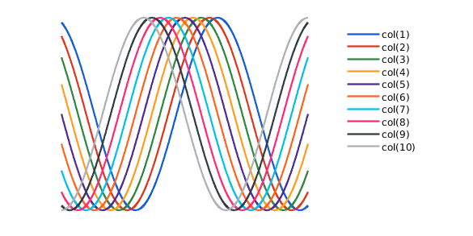

# MatEssentials

[](https://nl.mathworks.com/matlabcentral/fileexchange/126989-matlab-essentials)

MatEssentials (from Matlab Essentials) is an attempt to fill the gaps of common programming functions that are not included into the base installation. Some of these functions are for example `lerp`, `sigmoid`, `linespacen`, `rot2d`, `rotx`,  `random`, `randint`, `depfun`, `isodd`, `isneg` and many others. Additionally, we provide an extensive color packages with syntax `color_` and colormaps under `cmap_` (based on the matplotlib in Python).

## Installation
We highly recommend installing the essentials package using the [Matlab Package Manager](https://nl.mathworks.com/matlabcentral/fileexchange/54548-mpm?s_tid=srchtitle) (MPM), which can be easily installed via the Matlab Add-On Mananger . Once MPM is installed, the essential package can be installed by the following command in the Matlab command window

```bash
mpm install matessentials --all-paths
```

This will generate a folder under `MATLAB Add-Ons/Collections/mpm/mobeets-mpm-c626429/mpm-packages/matessentials/`.

## Improved Matlab colors
The package comes with an improved color pallete for plotting. These colors can simply be selected by `plot(...,'Color',col(int))` or can be overwritten
`set_color_pallete` (a dropdown menu appears to choose). 



## Improved Matlab colormaps
Matlab lacks many of the standard colormaps. Colormaps in the package are based on the ones from Python in the package MatPlotLib, which are given under `cmap_...`. These colormaps can also be modified using an additional input, e.g., `cmap_turbo(-1)` flips the colors, whereas `cmap_turbo(0)` mirrors the colormap.


## List of documented functions
Function Name | Description
--- | ---
`add2path` |  Add specified directory or current directory to the search path.
`annihil` |  Compute the annihilator of a set of vectors.
`background` |  Set the background color or image of the current figure.
`clamp` |  Limit the values of an array between lower and upper bounds.
`clr` |  Clear the command window, workspace, and figures, and turn off beep.
`cmapping` |  Interpolate, decimate, or flip a colormap.
`depfun` |  List dependencies required by a function.
`hex2rgb` | Convert hexadecimal color codes to  values.
`invlerp` |  Inverse linear interpolation.
`iseven` |  Check if an integer is even.
`isflint` |  Check if a scalar or vector is a floating-point integer.
`isneg` |  Check if a scalar is negative.
`isodd` |  Check if an integer is odd.
`ispos` |  Check if a scalar is positive.

